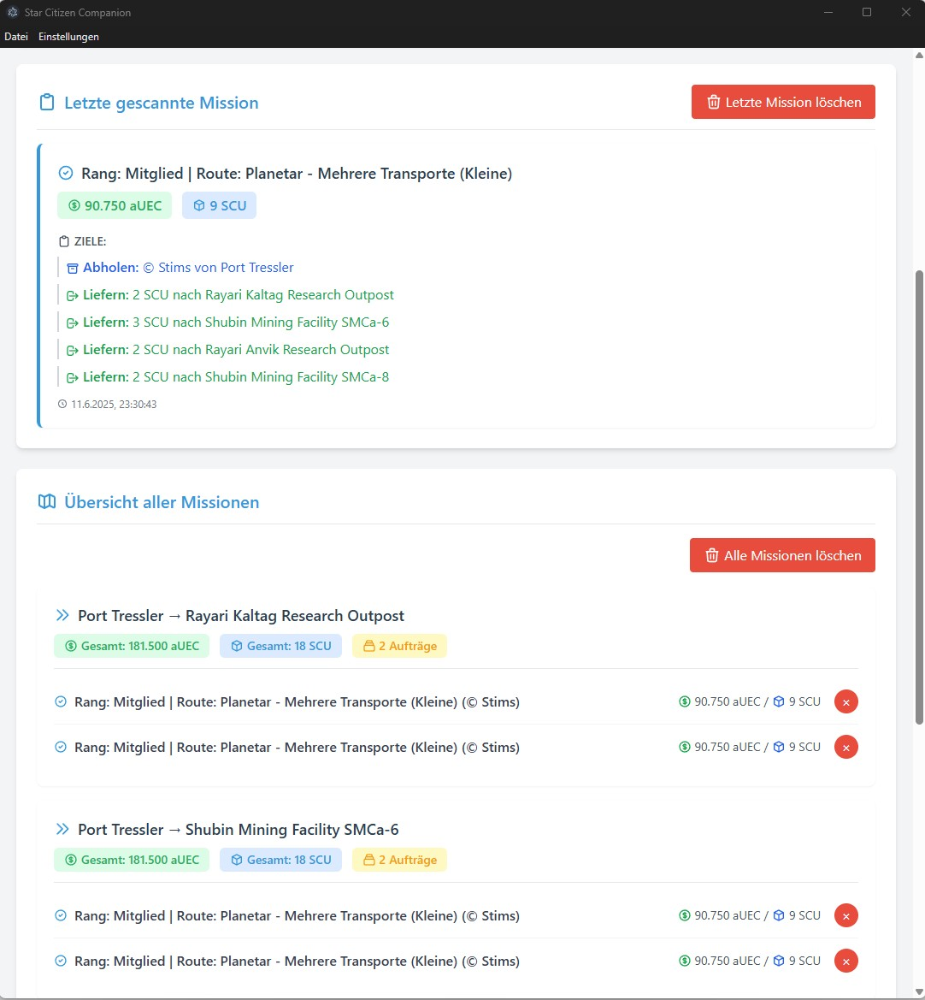

# Star Citizen Companion

Der **Star Citizen Companion** ist eine Desktop-Anwendung, die entwickelt wurde, um Spielern von Star Citizen das
Missionsmanagement zu erleichtern. Die Kernfunktionalität der App besteht darin, mittels Texterkennung (OCR) die Details
einer im Spiel angezeigten Mission zu erfassen, zu analysieren und für den Spieler übersichtlich aufzubereiten. Dies
ermöglicht es, Routen zu optimieren, Profite zu maximieren und den Überblick über mehrere Handels- und Liefermissionen
zu behalten.

## Aktuelle Downloads

### Star Citizen Companion 0.3.0 (2025-06-11)

Download: [StarCitizenCompanion.0.3.0.exe](https://github.com/saschaende/starcitizen-companion-official/releases/download/0.3.0/StarCitizenCompanion.0.3.0.exe)

- **Überarbeiteter Einrichtungsassistent:** Das Setup ist jetzt noch intuitiver – mit neuer Benutzeroberfläche, besserer Navigation und der Möglichkeit, den Vorgang jederzeit abzubrechen.
- **Einstellungsseite im neuen Look:** Die Einstellungen wurden optisch und funktional verbessert, sodass du schneller findest, was du suchst.
- **Flexible Fenstergrößen:** Passe die Größe des Einstellungsfensters jetzt individuell an deine Bedürfnisse an.
- **Sprachwahl:** Du kannst die Sprache der App nun direkt auswählen und umstellen. Dies ermöglicht nun Missions-Scans in Star Citizen auf deutsch oder englisch.
- **Verbesserte Hotkey-Beschreibung:** Die Eingabe und Erklärung von Tastenkombinationen wurde klarer gestaltet.